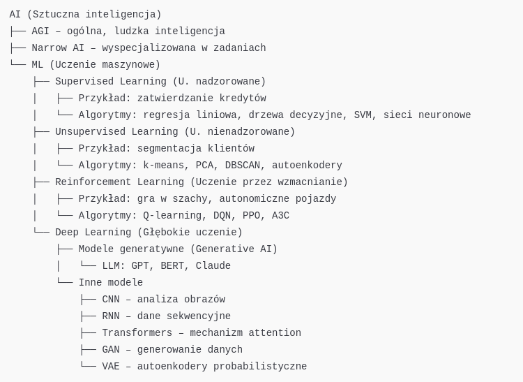
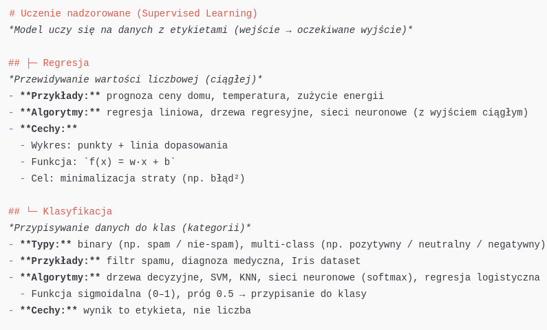
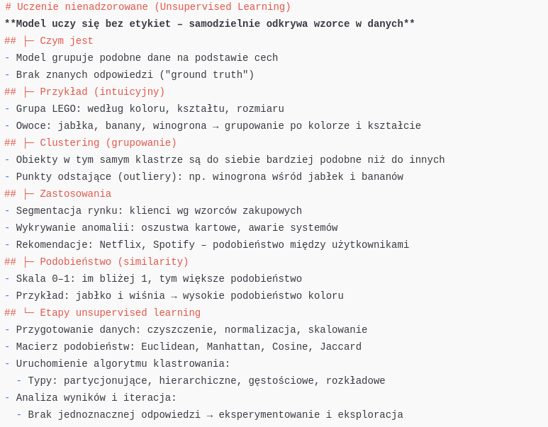
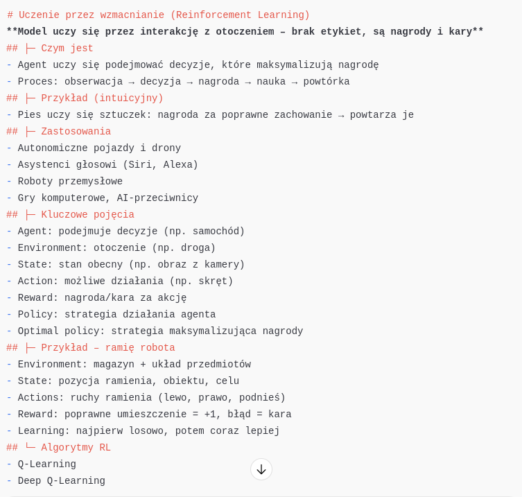
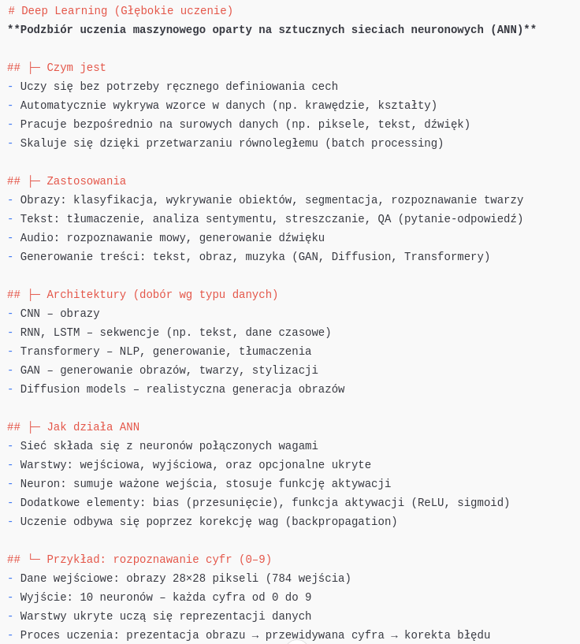

## Podział sztucznej inteligencji

Poniższy diagram przedstawia ogólny podział sztucznej inteligencji (AI), w tym miejsce uczenia maszynowego (ML), głębokiego uczenia (DL), modeli generatywnych oraz typów uczenia (nadzorowane, nienadzorowane, przez wzmacnianie).

---

## Uczenie nadzorowane (Supervised Learning)

Poniższy diagram przedstawia dwa główne typy zadań w uczeniu nadzorowanym: **regresję** i **klasyfikację**. Dla każdego typu pokazano cel, przykłady, używane algorytmy oraz charakterystyczne cechy.

---

## Uczenie nienadzorowane (Unsupervised Learning)

Poniższy diagram przedstawia główne cechy uczenia nienadzorowanego: grupowanie danych (clustering), miary podobieństwa oraz typowe zastosowania w segmentacji, detekcji anomalii i rekomendacjach.

---

## Uczenie przez wzmacnianie (Reinforcement Learning)

Poniższy diagram przedstawia podstawy uczenia przez wzmacnianie, w tym agenta, otoczenie, nagrody oraz przykłady zastosowań i algorytmy.

---

## Głębokie uczenie (Deep Learning)

Poniższy diagram przedstawia podstawowe elementy głębokiego uczenia, w tym architekturę sztucznych sieci neuronowych (ANN), typowe zastosowania, rodzaje danych oraz najczęściej używane modele, takie jak CNN, RNN, LSTM, transformery czy GAN.

---

## Modele sekwencyjne w deep learningu

**Modele sekwencyjne** to rodzina algorytmów głębokiego uczenia, które służą do przetwarzania danych w postaci uporządkowanych sekwencji (np. tekst, dźwięk, dane czasowe).

### Cechy:
- Uwzględniają kolejność danych – istotna jest relacja między elementami
- Przetwarzają dane krok po kroku, zapamiętując kontekst (stan ukryty)
- Pozwalają na przewidywanie kolejnych elementów, klasyfikację całych sekwencji lub generowanie nowych

### Przykładowe architektury:
- **RNN (Recurrent Neural Network)** – podstawowy model przetwarzający dane sekwencyjnie
- **LSTM (Long Short-Term Memory)** – ulepszony RNN z mechanizmem pamięci długoterminowej
- **GRU (Gated Recurrent Unit)** – uproszczony wariant LSTM
- **Transformers** – nowoczesne modele sekwencyjne bez rekurencji, bazujące na mechanizmie attention (np. GPT, BERT)

### Zastosowania:
- Przetwarzanie języka naturalnego (NLP): tłumaczenia, analiza sentymentu, generowanie tekstu
- Rozpoznawanie mowy: konwersja mowy na tekst
- Prognozy szeregów czasowych: dane finansowe, pogodowe
- Generowanie muzyki, rozpoznawanie gestów, analiza wideo

### Wybór modelu:
| Typ danych     | Przykład zastosowania             | Rekomendowane modele         |
|----------------|-----------------------------------|------------------------------|
| Tekst          | Tłumaczenie, streszczenie         | LSTM, GRU, Transformers      |
| Audio          | Rozpoznawanie mowy, generowanie   | RNN, LSTM, Transformers      |
| Time series    | Prognozowanie cen, pogody         | LSTM, GRU                    |
| Sekwencje gestów | Język migowy, sterowanie ruchem | RNN, LSTM                    |

---

> 📌 Modele sekwencyjne to fundament wielu zastosowań AI, w których istotna jest kolejność informacji. Ich rozwój – od RNN po transformery – umożliwił przełom w przetwarzaniu tekstu, mowy i danych czasowych.

---

## Modele konwolucyjne w deep learningu

**CNN (Convolutional Neural Networks)** to rodzina modeli głębokiego uczenia, wyspecjalizowana w analizie danych siatkowych, takich jak obrazy czy wideo. Automatycznie wykrywają i uczą się lokalnych cech (np. krawędzi, tekstur), co czyni je kluczowymi w zadaniach wizji komputerowej.

### Cechy:
- Przetwarzają dane w formacie przestrzennym (np. 2D obrazy)
- Automatyczna ekstrakcja cech z użyciem konwolucji i poolingów
- Odporność na przesunięcia, rotacje i inne transformacje obrazu
- Łączenie cech lokalnych w coraz bardziej abstrakcyjne reprezentacje

### Architektura:
- **Warstwa konwolucyjna (Convolutional Layer)** – wykrywa wzorce (np. krawędzie)
- **Funkcja aktywacji (np. ReLU)** – wprowadza nieliniowość
- **Pooling (np. Max Pooling)** – redukuje wymiarowość danych
- **Warstwa w pełni połączona (Fully Connected)** – dokonuje klasyfikacji
- **Softmax** – przelicza wynik na prawdopodobieństwa klas
- **Dropout** – ogranicza przeuczenie (overfitting)

### Zastosowania:
- Klasyfikacja obrazów (np. kot vs pies)
- Detekcja obiektów (rozpoznawanie twarzy, znaków drogowych)
- Segmentacja obrazu (np. w medycynie)
- Analiza obrazów satelitarnych i dronowych
- Diagnostyka medyczna (np. wykrywanie guzów)
- Systemy dla pojazdów autonomicznych

### Wybór modelu:

| Typ danych     | Przykład zastosowania                | Rekomendowane modele     |
|----------------|--------------------------------------|--------------------------|
| Obrazy         | Klasyfikacja obiektów                | CNN                      |
| Obrazy         | Segmentacja, detekcja                | CNN, YOLO, U-Net         |
| Medyczne obrazy| Analiza skanów (MRI, RTG)            | CNN                      |
| Satelitarne    | Klasyfikacja terenu, monitoring      | CNN, ResNet              |

---

> 📌 *Modele konwolucyjne zrewolucjonizowały przetwarzanie obrazów, eliminując potrzebę ręcznego projektowania cech. Dzięki warstwom konwolucyjnym sieci same uczą się reprezentacji, co znacząco zwiększa skuteczność klasyfikacji i analizy obrazów.*

